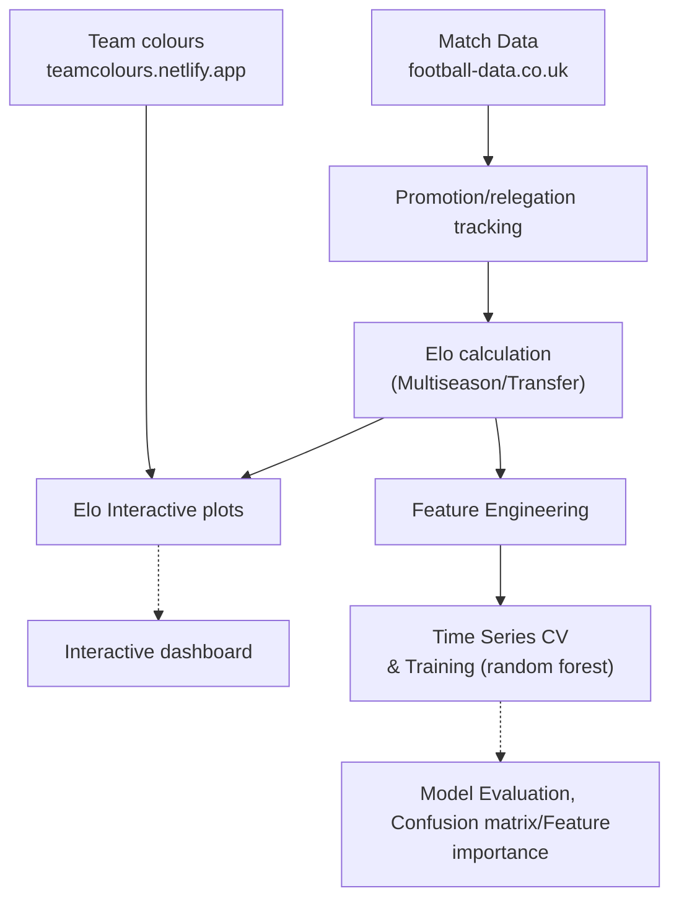
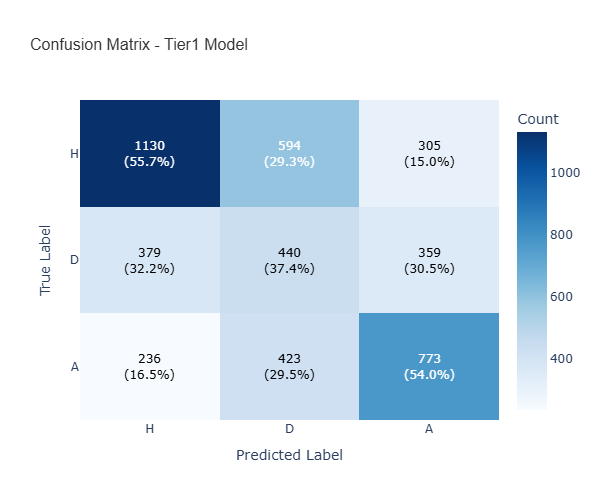

# footAI
 [](https://footai-j05t.onrender.com)

> **v1.0 - Production ML** | **Live Dashboard**

Calculate and visualize **Elo rankings** for football teams across major European leagues. This tool automatically downloads match data from [**football-data.co.uk**](https://football-data.co.uk/) — **weekly updated via GitHub Actions** — computes dynamic Elo ratings using the [standard formula](https://en.wikipedia.org/wiki/Elo_rating_system), and generates interactive visualizations of team performance over time. It also provides ML predictions with **50.51% accuracy** and **37.35% draw recall** (Top 5 leagues, 2015-2025).

**Key features:**
- Multi-season analysis with configurable decay (default 0.95 for tier 1 leagues and 0.90 for tier 2 leagues)
- Promotion/relegation Elo transfer  
- **Interactive plots and dashboard for each season** with multi-country/division selector (SP, IT, EN, DE, FR) and interactive season range slider (2015–2026)

Try it **live** on [pablo.matorras.com/footai](https://pablo.matorras.com/footai.html) 

**Production Model (Random Forest)- 3-Class Prediction (Home/Draw/Away):**
- **Accuracy**: 50.57% (Tier 1), 42.28% (Tier 2)
- **Draw Recall**: 37.35% (Tier 1), 46.33% (Tier 2)
- **Dataset**: Top 5 European leagues (SP, IT, EN, DE, FR), 2015-2025, **~40,000 matches**

> **⚠️ Disclaimer**: This project is for educational and research purposes only. Match predictions do not guarantee betting profitability. Always gamble responsibly. See [BeGambleAware.org](https://www.begambleaware.org/) for support.

## Table of Contents
- [Pipeline Overview](#pipeline-overview)
- [Installation & Quick Start](#installation--quick-start)
- [Usage](#usage)
- [Model Architecture](#model-architecture)
- [Supported Countries](#supported-countries--divisions)
- [Files & Outputs](#files-and-outputs)
- [Project Structure](#project-structure)
- [Roadmap](#roadmap)
- [License](#license)

## Pipeline overview
footAI follows a structured workflow from raw data acquisition to model deployment:




Each stage processes data through dedicated commands (`download`, `promotion-relegation`, `elo`, `features`, `train`, `plot`, `dashboard`). See [Installation & Quick Start](#installation--quick-start) to run the pipeline, or [Usage](#usage) for individual command details.

## Installation & Quick Start

### Requirements
- **Python 3.12+** required
- All dependencies auto-installed via pip (see [`pyproject.toml`](pyproject.toml))

### Setup 

```bash
# Clone repository
git clone https://github.com/pmatorras/footAI.git
cd footAI

# Create virtual environment
python -m venv .venv
source .venv/bin/activate  # On Windows: .venv\Scripts\activate

# Install in development mode
pip install -e .
```

### Run the Complete ML Pipeline

```bash
# Full pipeline: download → elo → features → train
make pipeline train

# Visualize results
make plot      # Generate Plots
make dashboard # Create interactive dashboards
```

**Live demo**: [pablo.matorras.com/footai](https://pablo.matorras.com/footai.html)  
**More commands**: Run `make help` or see [Usage](#usage)

---

## Usage
footAI provides four main commands to download data, calculate Elo ratings, track team movements, and visualize results.

### Commands

**download** - Fetch match data from [**football-data.co.uk**](https://football-data.co.uk/) for top 5 european leagues, and their team colours from [**teamcolours.netlify.app**](https://teamcolours.netlify.app/data.json)
```bash
footai download --country SP,IT,EN,DE,FR --season-start 15-25
```

**promotion-relegation** - Identify promoted/relegated teams between seasons
```bash
footai promotion-relegation --country SP,IT,EN,DE,FR --season-start 15-25
```

**elo** - Calculate Elo rankings for teams
```bash
footai elo --country SP,IT,EN,DE,FR --season-start 15-25
footai elo --season-start 23,24 -multi-season --decay-factor 0.95  # Multi-season with decay
```
**features** necessary for the ML training 
```bash
footai features --country SP,IT,EN,DE,FR --div SP1 --season-start 15-25 -multi-season
```
**train** - Train ML models (RandomForest default; supports multi-season, multi-division, multi-country, Elo transfer)
```bash
#Train a model per country and division
footai train --country SP,IT,EN,DE,FR --div tier1 --season-start 15-25 --elo-transfer  -multi-season 

#Train a combined model for top 5 country first divisions
footai train --country SP,IT,EN,DE,FR --div tier1 --season-start 15-25 --elo-transfer  -multi-country --feature-set=odds_lite

#With hyperparameter tuning
footai train --countries SP --div tier1  --season-start 15-25 --tune --tune-iterations 100
```

**plot** - Generate interactive visualizations of Elo progression
```bash
footai plot --country SP --season-start 24
```
#### Common Options

| Option | Description | Example |
|--------|-------------|---------|
| `--countries` | Country code(s) (comma or space separated) | `--countries SP,IT,EN` |
| `--division` | Division code or tier | `--division SP1` or `--division tier1` |
| `--season-start` | Season start year(s) (comma separated or range) | `--season-start 22,23,24` or `15-25` |
| `--features-set` | Feature configuration | `--features-set odds_optimized` |
| `--model` | Model type | `--model rf` (default), `xgb`, `lgbm` |
| `--multi-season, -ms` | Multi-season mode | `-ms` |
| `--elo-transfer` | Enable Elo transfer for promoted/relegated teams | `--elo-transfer` |
| `-v, --verbose` | Detailed output | `-v` |
<details> <summary><b>Complete flag reference (click to expand)</b></summary>

#### Global Options

All subcommands (`download`, `elo`, `plot`) support these options:

| Flag | Description | Example |
|------|-------------|---------|
| `--country` | Country code (default: SP) | `--country EN` |
| `--division, -div` | Division(s), comma-separated. Can take also `tier1/tier2` as possible options | `--div SP1,SP2` |
| `--season-start` | Season start year(s), comma-separated | `--season-start 22,23,24` |
| `--multi-countries` | Enable multi-country mode (train on multiple leagues) | `--multi-countries` |
| `--countries` | List of countries (requires `--multi-countries`) | `--countries SP IT EN` |
| `-v, --verbose` | Show detailed output | `-v` |
| `--processed-dir` | Directory for processed data | `--processed-dir my_output` |

#### Download  Options

| Flag | Type | Description |
|------|------|-------------|
| `--only-data` | flag | Download match data only (skip team colors) |
| `--only-colors` | flag | Download/update team colors only (skip match data) |

#### Elo-Specific Options

| Option | Short | Description | Default |
|--------|-------|-------------|---------|
| `--decay-factor` | Elo decay factor 0-1 (default: 0.95) | `--decay-factor 0.9` |

| `--raw-dir` | Directory for raw data (default: `football_data`) | `--raw-dir my_data` |

#### Training-Specific Options

| Option | Description | Default |
|--------|-------------|---------|
| `--model` | Chose what model to train | `rf` |
| `--features-set` | ML features (full list in `FEATURE_SETS` in [definitions.py](/src/footai/ml/feature_engineering/definitions.py). default: `odds_oprimized`) | `--features-set baseline` |
| `-ms, --multiseason` | Calculate across multiple seasons | `False` |
| `-md, --multi-division` | Train on combined divisions (e.g., I1+I2) | `False` |
| `-mc, --multi-countries` | Train on multiple countries simultaneously | `False` |
| `--nostats` | Suppress detailed statistics output | `False` |
| `--tune` | | flag | `False` | Run hyperparameter tuning before training |
| `--tune-iterations` | | int | `30` | Number of hyperparameter combinations to try (default: 30) |
| `--nostats` | | flag | `False` | Suppress detailed statistics output |
| `--no-viz` | | flag | `False` | Skip automatic visualization generation |

#### plot Options

| Flag | Type | Default | Description |
|------|------|---------|-------------|
| `--results-json` | path | `None` | Model results JSON for performance plots |
| `--output-dir` | path | `figures/model_viz` | Output directory for plots |
| `--top-n` | int | `15` | Number of top features to display in importance plots |
| `--elo-transfer` | flag | `False` | Use Elo transfer data (must match elo command) |
| `--multi-season` | flag | `False` | Plot across multiple seasons |

</details>

---

## Model Architecture

footAI uses a **tier-based Random Forest architecture** to predict match outcomes (Home/Draw/Away). The system deploys two specialized models: a **Tier 1 model** trained exclusively on top divisions (La Liga, Premier League, Serie A, Bundesliga, Ligue 1) achieving 50.5% accuracy and 37.4% draw recall, and a **Multi-Country model** trained on combined Tier 1 + Tier 2 data to improve lower-division predictions (42.28% accuracy, 46.33% draw recall). Both models significantly outperform random baseline (33.3% for 3-class prediction), with the Tier 2 model showing a +22.9% improvement in draw recall over tier-specific training.

The production models use the **odds_optimized feature set** (28 features) combining Elo ratings, rolling form statistics, market signals, and odds movement indicators. After systematic testing of gradient boosting variants (XGBoost, LightGBM) and neural networks, Random Forest was selected for its superior draw prediction capability—critical for betting value identification. While boosted models achieved 52-54% overall accuracy, they catastrophically failed at draw prediction (0-11.5% draw recall) due to minority class neglect, compared to Random Forest's 37.35% draw recall.

### Feature Sets

| Set | Features | Performance (Tier 1) | Use Case |
|-----|----------|---------------------|----------|
| `odds_optimized` | 28 | 50.57% acc, 37.35% DR | **Production (default)** |
| `odds_lite` | 25 | 50.42% acc, 38.08% DR | Simpler alternative |
| `baseline` | 12 | 50.14% acc, 35.7% DR | Baseline comparison|

**Key design decisions:**
- Shallow trees (`max_depth=5`) prevent overfitting on minority class (draws ~25% of matches)
- Tier-specific models maximize performance at each league level
- Custom scoring function balances overall accuracy with draw prediction (50/50 weighted)

### Model Performance

**Confusion Matrix - Tier 1 Model (Random Forest, odds_optimized)**



The model achieves 37.4% draw recall (440/1178 draws correctly predicted) with balanced home/away prediction (55.7% and 54.0% recall respectively). For Tier 2 and Multi-Country model confusion matrices, see [MODEL_CARD.md](MODEL_CARD.md).

**Feature Importance - Top 3 Features Across Models**

| Model | Top 3 Features | Combined Importance |
|-------|----------------|---------------------|
| **Tier 1** | `odds_away_prob_norm` (23.0%), `odds_home_prob_norm` (19.9%), `elo_diff` (12.1%) | 55.0% |
| **Tier 2** | `odds_away_prob_norm` (22.7%), `odds_home_prob_norm` (20.9%), `abs_odds_prob_diff` (14.5%) | 58.1% |
| **Multi-Country** | `odds_away_prob_norm` (23.2%), `odds_home_prob_norm` (21.6%), `elo_diff` (11.8%) | 56.6% |

All models consistently prioritize betting market signals (`odds_*_prob_norm`) and team strength differentials (`elo_diff`, `abs_odds_prob_diff`), demonstrating robust feature learning across league tiers. For complete feature rankings and importance plots, see [MODEL_CARD.md](MODEL_CARD.md).

For detailed experimental methodology, feature engineering rationale, and model selection process, see [feature_configuration.md](docs/feature_configuration.md) and [model_selection.md](docs/model_selection.md).

---

## Supported Countries & Divisions


The tool supports the following leagues, organized by country code and division identifier:

| Country | Code | Division | Division Code | League Name          |
|---------|------|----------|---------------|----------------------|
| Spain   | `SP` | Top tier | `SP1`         | La Liga              |
|         |      | Second   | `SP2`         | Segunda              |
| Italy   | `IT` | Top tier | `I1`          | Serie A              |
|         |      | Second   | `I2`          | Serie B              |
| 󠁧England | `EN` | Top tier | `E0`          | Premier League       |
|         |      | Second   | `E1`          | Championship         |
| Germany | `DE` | Top tier | `D1`          | Bundesliga           |
|         |      | Second   | `D2`          | 2. Bundesliga        |
| France  | `FR` | Top tier | `FR1`         | Ligue 1              |
|         |      | Second   | `FR2`         | Ligue 2              |

**Usage:** Specify the country code with `--country` and division code(s) with `--div`:

---

## Project Structure

**High-level organization:**

```bash
footAI/
├── .github/workflows/ # Automation (data updates, dashboard monitoring)
├── assets/            # Assets for main documents
├── data/              # Raw, processed, and feature data
├── docs/              # Technical documentation (feature engineering, model selection)
├── models/            # Trained model files
├── results/           # Training outputs (logs, metrics)
├── figures/           # Visualizations
└── src/footai/        # Source code
  ├── cli/             # Command-line interface
  ├── core/            # Elo calculations & team tracking
  ├── data/            # Data downloading
  ├── ml/              # Machine learning (features, models, evaluation)
  ├── utils/           # Configuration & helpers
  └── viz/             # Plotting & dashboard
```
### File Naming Conventions

Files follow the pattern: `{COUNTRY}_{SEASON}_{DIVISION}{SUFFIX}`

**Examples:**
- `SP_2324_SP1_elo.csv` → Spain, 2023/24, La Liga, Elo data
- `IT_2324_I1_feat.csv` → Italy, 2023/24, Serie A, features
- `EN_2223_E0_rf.pkl` → England, 2022/23, Premier League, model
- `tier1_1516_to_2526_odds_optimized_rf__20251126.txt` → Training log
- `tier1_1516_to_2526_odds_optimized_rf__20251126.json` → Metrics JSON

**Conventions:**
- **Seasons:** `2324` = 2023/24, `2223` = 2022/23, etc.
- **Multicountry:** described separated by `_` (e.g  `SP_IT_EN_DE_FR`)
- Training outputs: Located in `results/{COUNTRY}/` as `.txt` (full log) and `.json` (structured metrics)

<details>
<summary><b>Detailed directory structure (click to expand)</b></summary>

```bash
├── .github/workflows/                # GitHub Actions automation
│ ├── update_data.yml                 # Weekly data refresh
│ ├── dashboard_status.yml            # Dashboard health monitoring
│ └── lint-docs.yml                   # Documentation linting
├── assets/
│ ├── badge/dashboard_status          # Green if dashboard is on, red otherwise
│ └── img/                            # Commited figures for the documentation
├── data/
│ ├── raw/{COUNTRY}/                  # SP/, IT/, EN/, etc.
│ ├── processed/{COUNTRY}/            # Elo-enhanced data
│ │ └── promottions/                  # Data for each promoted and relegated team per season
│ └── features/{COUNTRY}/             # ML-ready features
├── docs/                             # Technical documentation
│ ├── feature_configuration.md        # Feature engineering experiments (5 phases)
│ ├── model_selection.md              # Model comparison & selection rationale
│ └── model_architecture_decisions.md # Architecture design decisions
├── models/{COUNTRY}/                 # Trained models
├── results/{COUNTRY}/                # Training logs & JSON metrics
├── figures/                          # Elo visualizations
│
├──src/footai/
│ ├── init.py
│ ├── main.py # Entry point for python -m footai
│ │
│ ├── cli/ # Command handlers
│ │ ├── parser.py # Argument parser setup
│ │ ├── train.py # Training command orchestration
│ │ ├── download.py # Download command handler
│ │ ├── elo.py # Elo command handler
│ │ ├── promotion.py # Promotion/relegation handler
│ │ ├── features.py # Feature engineering handler
│ │ └── plot.py # Plotting command handler
│ │
│ ├── core/ # Domain business logic
│ │ ├── elo.py # Elo rating calculations
│ │ └── team_movements.py # Promotion/relegation tracking
│ │
│ ├── data/ # Data acquisition & processing
│ │ ├── init.py
│ │ └── downloader.py  # Download match data from football-data.co.uk
│ │ └── team_colors.py # Download team color data from teamcolours.netlify.app
│ │
│ ├── ml/                      # Machine Learning (NEW)
│ │ ├── feature_engineering.py # Rolling features, odds normalization
│ │ ├── models.py              # Model training (RandomForest, XGBoost)
│ │ └── evaluation.py          # Results summary, benchmarks, metrics
│ │
│ ├── utils/ # Shared infrastructure
│ │ ├── config.py # Constants, feature sets, directories
│ │ ├── paths.py # File path construction
│ │ ├── validators.py # Input validation
│ │ └── logger.py # Training run logging (stdout -> file)
│ │
│ ├── viz/ # Visualization & UI
│ ├── init.py
│ ├── plotter.py # Interactive Plotly charts
│ ├── dashboard.py # Dash web dashboard
└── themes.py # Color palettes & styling
```
</details>


## Roadmap

### Current Status (v1.0 - November 2025)

- Elo rating engine with multi-season support and configurable decay (0.95 tier1, 0.90 tier2)
- Promotion/relegation tracking with Elo transfer (0.95 decay)
- Systematic feature engineering across 5 experimental phases
- Production feature sets: `odds_optimized` (28), `odds_lite` (25), `baseline` (12)
- Tier-based model architecture (Tier 1 specialist + Multi-Country model)
- Hyperparameter tuning via RandomizedSearchCV with custom draw-weighted scorer
- RandomForest training with temporal cross-validation (TimeSeriesSplit)
- Training result logging (`.txt` logs + `.json` metrics)
- Multi-country support (SP, IT, EN, DE, FR) with tier 1 + tier 2 divisions
- Multi-division training capability (e.g., Serie A + Serie B combined)
- Interactive dashboard deployed at [pablo.matorras.com/footai](https://pablo.matorras.com/footai.html)

**Performance Benchmarks (Top 5 European Leagues, 2015-2025):**
- **Tier 1**: 50.5% accuracy, 37.4% draw recall (vs 33.3% random baseline)
- **Tier 2**: 42.28% accuracy, 46.33% draw recall
- **Total improvement**: +1.65% draw recall over baseline (35.7% → 37.35%)
- **Feature consistency**: Market odds + Elo differentials drive 55-58% of predictions across all models

---

### Future Work (v1.1+)

**Model Improvements:**
- Probability calibration (Platt scaling, isotonic regression) for better confidence estimates
- SHAP explainability (per-match feature importance, counterfactual analysis)
- Mixture-of-experts architecture (conditional routing based on draw probability)

**Advanced Features:**
- Squad value integration (Transfermarkt API) for team strength indicators
- Player-level features (injuries, suspensions, form) for deeper model inputs
- xG (expected goals) data from advanced sources (Understat, FBref)

**Predictions & Deployment:**
- Live match predictions via API-Football integration
- Monte Carlo season simulations (league table, top 4, relegation probabilities)
- Web API (FastAPI) for serving model predictions
- Betting strategy backtesting with Kelly criterion and ROI tracking


 
## License

MIT License - see LICENSE file

---

**Maintainer:** [@pmatorras](https://github.com/pmatorras)